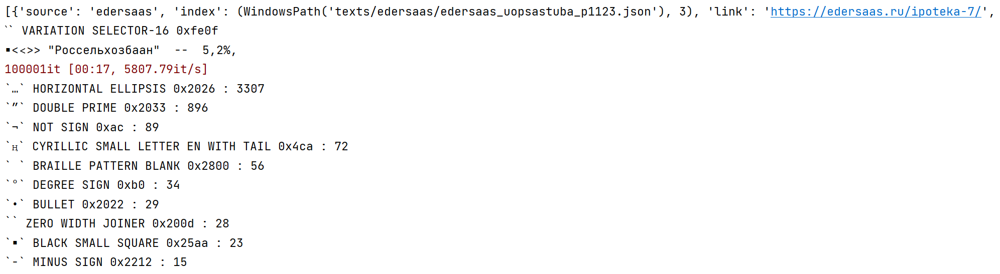
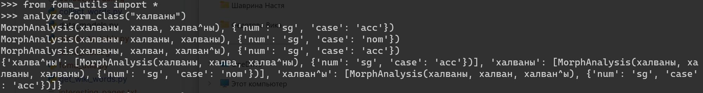
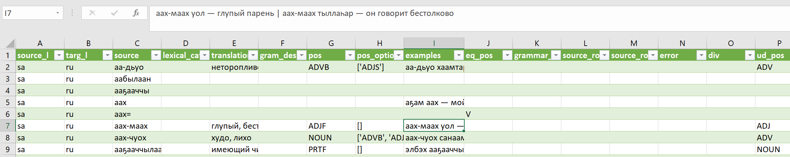

# Sakha corpus

Contents
========
 * [Installation](#installation)
 * [Usage](#usage)
 
## Installation
This was developed with python `3.7.1`, then `3.9.10`.
Most code should be compatible with the former, except for `spacy`

1. Use venv (create it and switch to it [as described here](https://docs.python.org/3/tutorial/venv.html))
   Windows `cmd`:
   ```bash
    python -m venv venv
    venv\Scripts\activate.bat 
    ```
   Windows `PowerShell`:
   ```bash
    python -m venv venv
    venv\Scripts\Activate.ps1
    ```
   Linux:
   ```bash
    python -m venv venv
    source venv/Scripts/activate
    ```
2. Use [pip](https://pip.pypa.io/en/stable/) to install the dependencies.
    This is needed only for the pipeline (`requirements_pipeline.txt`),
    which uses `nltk.tokenizer.Punkt` for sentences and `spacy` for russian analysis
    and general tokenization.
    ```bash
    pip install -r requirements_pipeline.txt
    ```

## Usage

Pipeline

Сейчас, поскольку использует `foma`, требует UNIX с установленным `libfoma-dev`...

* Файлы
  * `data_models.py` &mdash; API для итерации и индексирования данных,
    в будущем все данные будут оформлены таким или похожим образом;
  * `tidy_string.py` &mdash; разные группы преобразований с целью нормализации;
  * `profile_characters.py` &mdash; посмотреть на символы, которые не принадлежат небольшому алфавиту и при этом не улавливаются общими преобразующими правилами;  
    
  * `pipeline.py` &mdash; общий пайплайн обработки текста.
    * `train_sentence_tok.py` &mdash; тренировка токенизатора предложений (первая,
    без препроцессинга. Её результат - файл `sakha_edersaas_0.pickle`, см. ниже)
  * `nltk.tokenizer.Punkt` для парсинга на предложения
  * [`spacy`](https://spacy.io) для токенизации и анализа русксого.  (пока не до конца)
  * [`foma`](https://fomafst.github.io/) конечный преобразователь (FST) для якутского (по правилам в табличке)
    * `foma_utils.py` функции для работы с морфоанализатором (и в сторону анализа и в сторону генерации).  
     Для введённой формы выдаётся словарь с разными возможными морфологическими сегментациями формы и соответствующими анализами

    

Правила записываются не сразу, а в достаточно абстрактном виде в таблице, которая потом преобразуется в грамматику.
В будущем это позволит внеся не слишком большие изменения, добавить новый анализатор, грамматика для которого будет строиться по уже существующей таблице (`rules.xlsx`). 
* `/foma/rules2foma.py` csv файлы в исходники _foma_ (`.lexc` and ` .foma`) 

То, что ниже, в целом уже было сделано до курса:

**Парсинг** сайта словаря [sakhatyla.ru](http://sakhatyla.ru):
*  `collect_words.py`, `utils.py` (с помощью словариков в `data-metadata`)
   сбор слов из строки поиска
* `parse.py`, `lexemes.py`  
   довольно страшный парсинговый код, но даёт неплохую табличку типа `sakhatyla.csv`, где представлены слова с сайта с разборами.  
   Поскольку части речи в словаре странные, русское определение / перевод разбирается в UDPipe и записывается вершина разбора (`retag_pos_ud.py`: `sakhtyla_udtransl.csv`)




**Итог:** сейчас имеем немало текстов, умеем неплохо разбивать якутский текст на предложения, токенизировать их, переводить таблицу с правилами в общем виде в вид фомы, и разбирать слова морфологически по этой грамматике!


